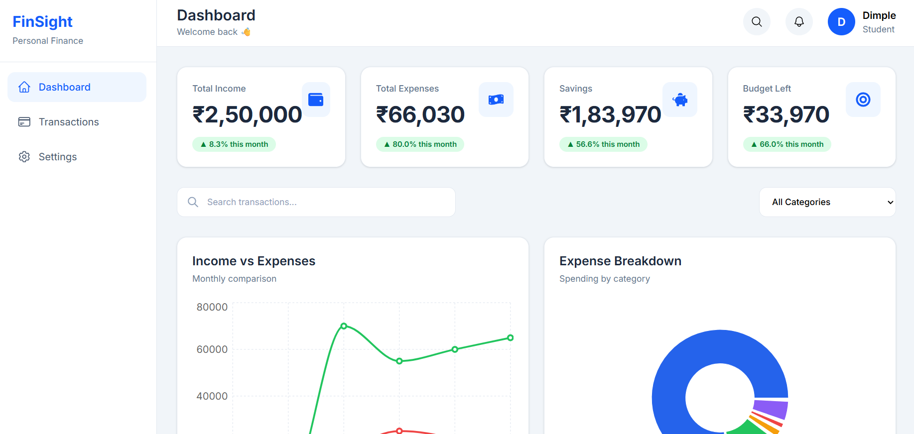
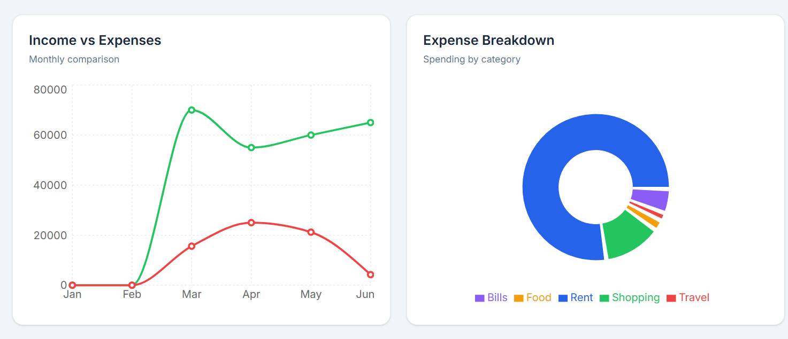
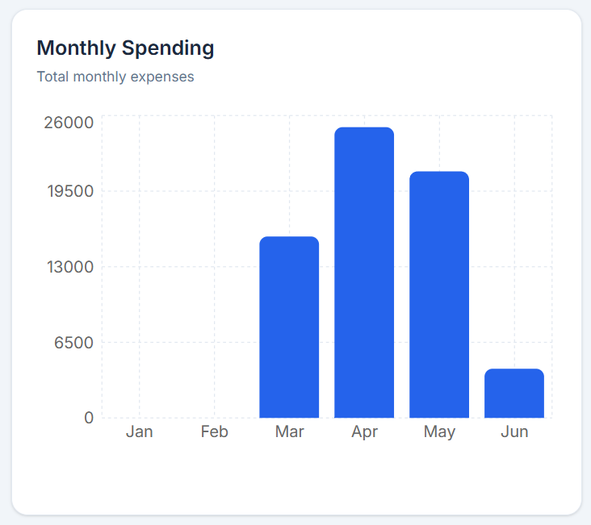
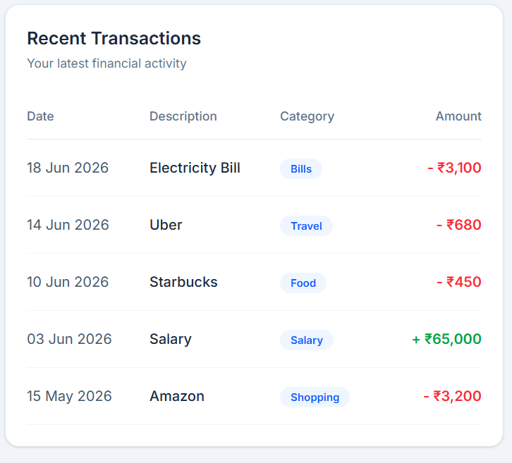

# Personal Finance Dashboard - FinSight

A modern and responsive **Personal Finance Dashboard** built using **React**, **TypeScript**, **Tailwind CSS**, and **Recharts**. The dashboard provides users with an intuitive interface to visualize financial data through interactive charts, KPI cards, and transaction analytics.

---

## 📌 Features

* Interactive Analytics Dashboard
* KPI Cards

  * Total Income
  * Total Expenses
  * Total Savings
  * Budget Left
* Income vs Expenses Line Chart
* Expense Breakdown Pie Chart
* Monthly Spending Bar Chart
* Search Transactions
* Filter Transactions by Category
* Recent Transactions Table
* Fully Responsive Design
* Modern UI with Tailwind CSS

---

## 🛠️ Tech Stack

| Technology   | Usage              |
| ------------ | ------------------ |
| React        | Frontend Framework |
| TypeScript   | Static Typing      |
| Tailwind CSS | Styling            |
| Recharts     | Data Visualization |
| React Icons  | Icons              |
| Vite         | Build Tool         |

---

## 📂 Folder Structure

```text
src
├── components
│   ├── dashboard
│   │   ├── Charts
│   │   ├── Filter.tsx
│   │   ├── KPICard.tsx
│   │   ├── SearchBar.tsx
│   │   └── TransactionTable.tsx
│   ├── layout
│   └── common
│
├── data
├── pages
├── styles
├── types
├── utils
├── App.tsx
└── main.tsx
```

---

## 🚀 Getting Started

### Clone the repository

```bash
git clone https://github.com/your-username/personal-finance-dashboard.git
```

### Navigate to the project directory

```bash
cd personal-finance-dashboard
```

### Install dependencies

```bash
npm install
```

### Start the development server

```bash
npm run dev
```

The application will be available at:

```text
http://localhost:5173
```

---

## 📸 Screenshots

* Dashboard



* Charts




* Transactions



---

## 📊 Dashboard Modules

* KPI Cards
* Search Bar
* Category Filter
* Income vs Expenses Chart
* Expense Breakdown Chart
* Monthly Spending Chart
* Recent Transactions Table

---

## 🎯 Future Enhancements

* Add New Transactions
* Edit Transactions
* Delete Transactions
* Date Range Filter
* Sorting Options
* Budget Management
* Export Reports (CSV/PDF)
* Dark Mode
* User Authentication
* Backend Integration

---

## 📚 Learning Outcomes

* Component-based architecture using React
* State management with React Hooks
* Type-safe development using TypeScript
* Responsive UI design with Tailwind CSS
* Data visualization using Recharts
* Search and filtering techniques
* Reusable utility functions
* Scalable project structure

---

## 👨‍💻 Author

**Dimple Rogha**

BCA (Artificial Intelligence & Machine Learning)

UPES Dehradun

---

## 📄 License

This project was developed for educational and internship purposes.
